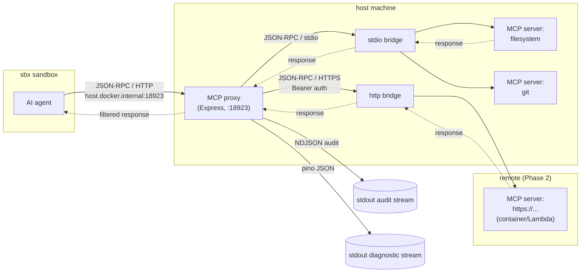
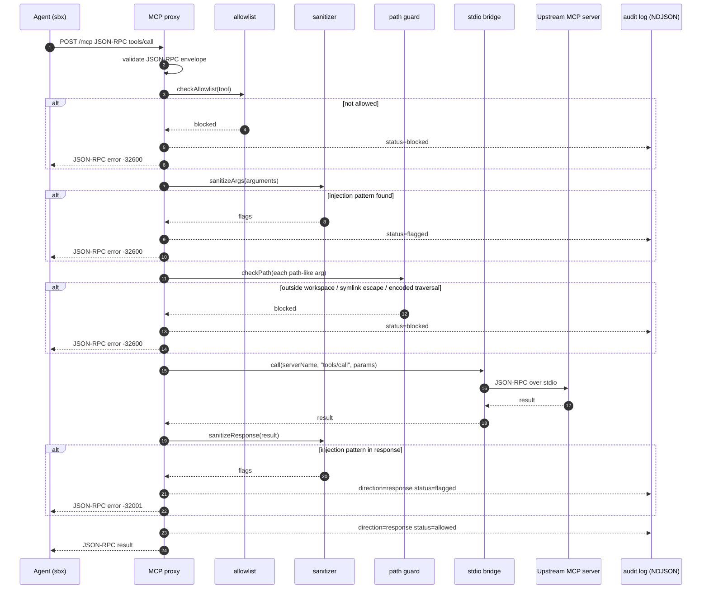

# Architecture

agentic-press is a thin orchestration layer on top of Docker Sandbox (`sbx`). It adds an MCP proxy that mediates every MCP tool call made by a sandboxed agent, enforces an allowlist and a path guard, scans arguments for injection patterns, and writes an audit record per request. It does not reimplement sandbox management, container runtime, or network policy — `sbx` owns all of that.

For component-level setup, tuning, and troubleshooting see the sibling docs: [`./setup.md`](./setup.md), [`./sbx-reference.md`](./sbx-reference.md), [`./security.md`](./security.md), [`./observability.md`](./observability.md), [`./development.md`](./development.md).

## Topology

Three execution domains:

1. **sbx sandbox** — a Docker-backed isolated environment containing the AI agent (Claude Code, Codex, etc.). The agent has no direct access to host MCP servers.
2. **Host — MCP proxy** — an Express HTTP server (default port `18923`) reachable from the sandbox over `host.docker.internal`. Implemented in `src/mcp-proxy/server.ts`.
3. **Upstream MCP servers** — reached via one of two transports selected per server in `MCP_SERVERS`:
   - **stdio** (default) — local subprocess on the host (filesystem, git, github, custom). Spawned as a child process; JSON-RPC over stdin/stdout. Implemented in `src/mcp-proxy/stdio-bridge.ts`.
   - **http** (Streamable HTTP) — remote MCP server reachable over HTTPS. Targets containers, sidecars, or services. Plain `http://` is permitted only for `localhost` / `127.0.0.1` / `::1`; `https://` is required for any other host. Implemented in `src/mcp-proxy/http-bridge.ts`.

The sandbox speaks JSON-RPC 2.0 over HTTP to the proxy. The proxy speaks JSON-RPC 2.0 over stdio (subprocess) or HTTP POST (remote) to the upstream servers. The composite transport in `src/mcp-proxy/transport.ts` dispatches `call(serverName, ...)` to the bridge that owns that server. Agents never see the upstream servers directly.

## Request pipeline

Every `POST /mcp` request runs through a fixed ordered pipeline in `createProxyServer`. Each stage can short-circuit with a JSON-RPC error and an audit entry. A correlation id (`randomBytes(8).toString("hex")`) is generated per request, bound to a pino child logger, and echoed to the client on internal errors so operators can grep server logs.

Pipeline stages, in order:

1. **Envelope validation.** Rejects anything that is not a well-formed JSON-RPC 2.0 object with `method` and `id`. Only `tools/call` is accepted; other methods return `-32601`.
2. **Allowlist check** (`src/mcp-proxy/allowlist.ts`). Tool name is matched against configured patterns. Supports exact match, bare `*` catch-all, and single suffix wildcard (for example `echo__*`). Unmatched tools are blocked.
3. **Argument sanitization** (`src/mcp-proxy/sanitizer.ts`). All string values reachable inside `arguments` (recursively — not the serialized JSON blob) are tested against the injection pattern set from `src/security/injection-patterns.ts`. Any match flags the request.
4. **Path guard** (`src/security/path-guard.ts`). Every string in `arguments` that looks path-like (starts with `/`, `./`, `../`, `~/`, or a drive letter) is resolved against `workspaceRoot`, symlinks included via `realpathSync`. Paths outside root, with null bytes, with backslashes, with drive letters, or with encoded traversal sequences are blocked.
5. **Routing.** `resolveRoute` picks an upstream server by matching the tool name against `serverRoutes` (exact patterns sorted ahead of wildcards, longer prefixes ahead of shorter).
6. **Forwarding.** The stdio bridge sends the JSON-RPC frame to the chosen upstream server and awaits its reply (30 s timeout). The bridge also enforces a read-layer **response size cap** (`MAX_RESPONSE_BYTES`, default 10 MiB): any single upstream response line exceeding the cap is rejected before JSON parsing so a hostile upstream cannot OOM the proxy. The in-flight call is rejected with the same JSON-RPC `-32001` envelope used by the response sanitizer (no distinct DoS-defense signal that an attacker could use to size-probe), and the audit entry carries `errorMessage="response size cap exceeded"`. Set `MAX_RESPONSE_BYTES=0` to disable.
7. **Response sanitization** (`src/mcp-proxy/response-sanitizer.ts`). The upstream result is walked recursively; every string-valued field is tested against the same injection pattern set used on requests. On any flag the response is rejected with JSON-RPC error `-32001` — raw matched content is never echoed back to the agent. Image/audio content blocks skip only their binary fields (`data`, `blob`) — sibling text is still walked because `type` is attacker-controlled. Walker is cycle-safe (WeakSet) and depth-capped (64); failure fails closed. See [`./security.md`](./security.md) (CVE-2025-6514).
8. **Audit.** Every outcome (`allowed`, `blocked`, `flagged`, `error`) is emitted as a single NDJSON line via `logAuditEntry` with `tool`, `args`, `status`, `flags`, `durationMs`, `direction` (`request` or `response`), optional `errorMessage`.

On any unexpected exception the client sees only `Internal proxy error (ref: <correlationId>)`. Raw error strings are never returned — they go to the diagnostic log alongside the same correlation id. See [`./security.md`](./security.md) for the rationale.

## Stdio bridge

`createStdioBridge` lazily spawns each configured upstream server (`stdio: ["pipe", "pipe", "inherit"]`) on first use and multiplexes JSON-RPC frames over its stdin/stdout. Stderr is inherited so server diagnostics reach the host console directly.

Key behaviors:

- **Fail-fast on broken spawns.** If the first N (default 5) stdout lines from a server are all non-JSON and no JSON frame has been seen, the spawn is declared permanently broken, pending calls are rejected with an actionable message, and the process is killed. No silent respawn.
- **One-shot warning.** The first non-JSON line seen from any server is logged at `error` level regardless of `LOG_LEVEL`, pointing operators at the root cause of what would otherwise surface as mysterious 30-second timeouts.
- **Response size cap.** A read-layer cap (`MAX_RESPONSE_BYTES`, default 10 MiB) rejects any single upstream response line that exceeds the threshold before JSON parsing runs, preventing OOM via a hostile or runaway upstream. The check fires both on the trailing partial buffer (line still mid-flight) and on each completed line. Set to 0 to disable.
- **Graceful shutdown.** `shutdownOne` sends `SIGTERM`, races a grace period (default 5 s), escalates to `SIGKILL`, then races a hard ceiling (default 2 s) and logs a leak if the kernel still has not reaped the child.
- **Timeouts.** Every `call` registers a 30 s timeout per request id; expired requests reject and drop their pending handler.

## Security model

The proxy enforces three independent controls. Defense in depth is intentional — bypassing one does not bypass the others. Details and CVE citations live in [`./security.md`](./security.md); the summary:

| Control | File | Blocks |
|---|---|---|
| allowlist | `src/mcp-proxy/allowlist.ts` | Any tool name not matching a configured pattern. Malformed config blocks everything. |
| sanitizer (request + response) | `src/mcp-proxy/sanitizer.ts`, `src/mcp-proxy/response-sanitizer.ts`, `src/security/injection-patterns.ts` | Prompt-injection text, turn-boundary markers, zero-width unicode, dangerous base64, `<script>` / iframe / event-handler markup, `javascript:` URIs, markdown image exfiltration, injected `tools` / `function_call` / `</tool_result>` fragments — applied to **both** request arguments and upstream responses. Clean-room patterns sourced from OWASP LLM Top 10, the MCP spec, and published CVEs (incl. CVE-2025-6514). |
| path guard | `src/security/path-guard.ts` | Null bytes, backslashes, drive letters, encoded traversal (`%2e%2e`, double-encoded, overlong UTF-8, fullwidth), logical escape from `workspaceRoot`, symlink escape (CVE-2025-53109), containment bypass (CVE-2025-53110). |

Mode flags for the sanitizer (`flag` | `strip` | `block`) exist in the library; the server currently runs in the default flag-and-reject mode — a flagged request is refused with a JSON-RPC error rather than silently stripped.

## Logging and observability

Two independent stdout streams, both structured:

- **Diagnostic** — pino JSON, one child logger per module (`childLogger("mcp-proxy")`, `childLogger("stdio-bridge")`, etc.). Per-request child loggers bind `correlationId` as a field. Pipe through `pino-pretty` in development.
- **Audit** — NDJSON written directly by `logAuditEntry`, one line per request outcome, schema defined by `AuditEntry`.

Optional Langfuse tracing is wired through a `Tracer` interface; the default is a noop tracer so the request path has zero coupling to observability. Tracer exceptions are caught and logged — they can never break a request. Langfuse and Grafana integration details live in [`./observability.md`](./observability.md).

## What this repo does not own

- Sandbox lifecycle, container runtime, network policy — owned by `sbx`. Never reimplemented here.
- Dashboard UI — Mission Control is adopted as-is through a thin adapter.
- Auth, multi-tenancy, OMC integration, AWS headless mode — out of scope for Phase 1.

See `CLAUDE.md` for phase planning and platform strategy beyond Phase 1.
